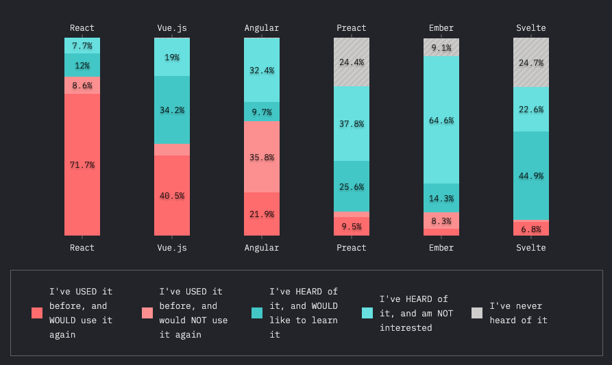
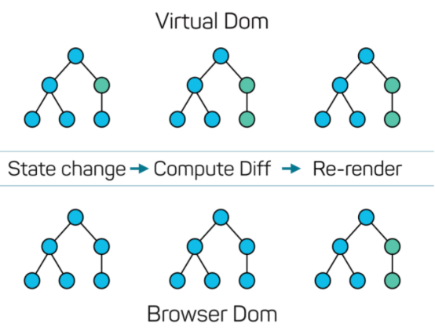
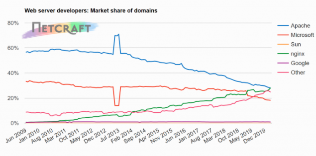
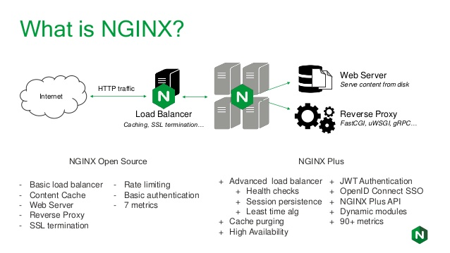

# Angular vs React 
### We are down to two choices or three if including Vue.js.
### Angular and React are leaders in Frontend framework.

---
<br/>
<br/>

## Angular
- Steep learning curve
- Complete framework
- Must follow exact rules and patterns witin it.
- TypeScript
- Google
<br/>

## React
- Not a complete framework, but JS libraries
- Learning curve for the core library isn't steep
- Need to choose from 3rd party libraries for any outside from the core lib. Learning many different libraries can be challenging.
- Facebook

  https://2019.stateofjs.com/front-end-frameworks/

- Interesting survey.  Which one Hates or loves?


---
## Concept of React
- React is Declarative
- React effectively render and update view when the data changes. 
- Virtual DOM

- Components. Breaking down to any small components.  
- Manage states in Each components.  
- Class vs functional components. 

```javascript
// Functional component or called dumb component
import React from "react";

const Person = props => (
  <div>
    <h1>Hello, {props.name}</h1>
  </div>
);

export default Person;
```

```javascript
// Class component - maintain state
import React, { Component } from "react";

class Person extends Component {
  constructor(props){
    super(props);
    this.state = {
      myState: true;
    }
  }
  
  render() {
    return (
      <div>
        <h1>Hello Person</h1>
      </div>
    );
  }
}

export default Person;
```


- JSX, HTML like syntax. Extends ECMAscript so that it coexists with JS/React code.

```javascript
  return (
    <div><h2>{`Name|Description|PortType|Enabled|Link`}</h2>
      {switches ?
        <ul>
          {switches.map((s,i) => <li key={i}>
            {s.name}|
            {s.description}|{s.portType}|
            {s.enabled ? 'True' : 'False'}| 
            {s.link}</li>
          )}
        </ul> : null}
    </div>
  )
```

- ECMAScript version. ES6 is used in React.  ES6 is ECMAScript 2015 or later.

<br/>
<br/>
  
## Scafolding, building, deploying
### Webpack
- https://webpack.js.org
- General purpose builder
- Flexible and detail customization
- Fit for big and highly customized project

### CRA (create-react-app)
- https://github.com/facebook/create-react-app
- CRA creates React boilerplate including test harness
- CRA create default webpack (but not customizable)
- We can start a new projet within minutes
- Fit for any project not requiring webpack customization

```javascript
# after install npm
$ npx create-react-app helloworld
```

### React Hooks. What is and why Hooks?  
- A new addition in React 16.8 (current is 16.13.x)
- Use state and other React features without writing a class
- (this means functional components for almost all UI rendering.)
- "useState" and "useEffect" are two most basic Hooks

```javascript
// Class component - maintain state
import React, { Component } from "react";

class Person extends Component {
  constructor(props){
    super(props);
    this.state = {
      myState: true;
    }
  }
  
  render() {
    return (
      <div>
        <h1>Hello Person</h1>
      </div>
    );
  }
}
export default Person;
```

```javascript
// Functional component with Hooks
import React, { useState } from "react";

const Person = () => {

  const [mystate, setMystate] = useState(true);

  return (
    <div>
      <h1>Hello Person</h1>
    </div>
  );
  }
}
export default Person;
```

## SPA (Single Page App) vs MPA (Multi Page App)
* Multi Page App utilizes 'react-router-dom' 
* SPA for a very small appliation, but most of our application should need to be MPA.

## CSS Framework
* Material UI <- Most active 
* Bootstrap 
* Ant Design 
* Semantic UI 
* Blueprint

## Dockerize
* Multi-stage (mostly two stages) build is common
* Create build-stage for build image 
* Cache build image
* Create docker with Nginx
* Move build image to Nginx static folder
* Remove docker from build-stage
* Deploy Docker with Nginx + build image

```sh
    # note that the following is not multi-stage.
    # use single stage for brevity.
    #
    # build environment
    FROM node:13.12.0-alpine as build
    WORKDIR /app
    ENV PATH /app/node_modules/.bin:$PATH
    COPY package.json ./
    COPY package-lock.json ./
    RUN npm ci --silent
    RUN npm install react-scripts@3.4.1 -g --silent
    COPY . ./
    RUN npm run build

    # production environment
    FROM nginx:stable-alpine
    COPY --from=build /app/build /usr/share/nginx/html
    # new
    COPY nginx/nginx.conf /etc/nginx/conf.d/default.conf
    EXPOSE 80
    CMD ["nginx", "-g", "daemon off;"]
```

```sh
    # nginx.conf
    server {

      listen 80;

      location / {
        root   /usr/share/nginx/html;
        index  index.html index.htm;
        try_files $uri $uri/ /index.html;
      }

      error_page   500 502 503 504  /50x.html;

      location = /50x.html {
        root   /usr/share/nginx/html;
      }

    }
```

## Testing (including API mocker)
* React comes with Jest test lib (similar to Jasmine, Mocha)
* API mocker libs
* UI integration testing, Cypress is modern and is relatively easy, advanced and less overhead compared to Selenium. https://www.cypress.io/ 

## Webserver

* Performance with Ngnix is significantly better than Apache.
* We can see the pattern of migration from Apache to Nginx or other.




https://www.netcraft.com

* Aforementioned Nginx is de facto for building modern web application.
* Two flavors of Nginx,  Nginx or NginxPlus
* Nginx is open source (free)
* NginxPlus is commercial with addition of advanced service on top of Nginx, https://www.nginx.com/products/nginx/#compare-versions



https://www.nginx.org

## OAuth2/OIDC 
* OIDC connection from NginxPlus ($2500/year per instance) -> not free
* OpenResty OIDC - OpenResty is a superset of Nginx, but bundled with LuaJIT scripting language.($0) -> free  
* https://github.com/zmartzone/lua-resty-openidc
* https://developers.redhat.com/blog/2018/10/08/configuring-nginx-keycloak-oauth-oidc/
* For testing environment, RedHat Keycloak acts as an authorization server in OAuth-based SSO. https://www.keycloak.org/
* docker-compose file for Keycloak is in this repo.


## DEMO 
* JSON Sever - local API endpoint
* Using CRA to create a new application
I React Hooks
* API calls to JSON server
* DOM update


